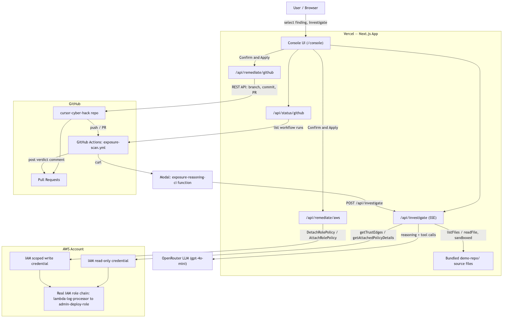

<p align="center">
  
</p>

<h1 align="center">Lighthouse</h1>

<p align="center">
An AI agent that fuses <b>code reachability</b>, <b>real AWS IAM blast-radius</b>, and <b>vulnerability capability</b> into one holistic severity verdict — instead of ranking findings by raw CVSS score alone.
</p>

<p align="center"><b>Live:</b> https://cursor-cyber-hack.vercel.app</p>

<p align="center">Built for the Cursor Cybersecurity Hackathon — London, 1 August 2026</p>

---

## Why this exists

Security teams don't lack findings — they drown in them. **41% of AppSec teams name vulnerability prioritization as their #1 challenge.** CVSS scores a vulnerability in isolation; they say nothing about whether the vulnerable code actually runs, or what the service it runs under can actually reach. Meanwhile **the average enterprise employee holds ~96,000 permissions** — no human traces reachability across a graph that large by hand.

This agent answers the question CVSS can't: *if this specific vulnerability is exploited, what is the worst realistic thing an attacker could do, step by step, and why does it matter to the business?*

## The pipeline

```
Snyk finding (patient zero)
   │
   ▼
Code reachability check ── agent reads real source files, follows the
   │                        import/call chain itself (sandboxed, can't
   │                        escape the demo repo) — is the vulnerable
   │                        function actually invoked, or dead code?
   ▼
AWS IAM blast-radius trace ── agent walks a REAL AWS account's IAM trust
   │                           graph (AssumeRole/PassRole/AttachRolePolicy),
   │                           reading raw policy actions/resources itself
   │                           rather than trusting a pre-baked severity tag
   ▼
Holistic verdict ── severity + a plain-English attack narrative
   │                 ("if exploited, here's exactly what happens and
   │                  why it matters"), not a technical path summary
   ▼
Human-approved remediation ── agent PROPOSES a fix (AWS policy detach,
                               or a real GitHub PR with a code patch);
                               a human must click "Confirm & Apply"
                               before anything actually executes
```

Every arrow above is real, not narrated: real source files, a real AWS account, a real deployed agent, a real GitHub PR when remediation is approved.

## Architecture



## Case study: three findings

**`SNYK-2026-001`** — `log-utils-lite@1.2.3`, CVSS 6.5 (the kind of score that sits in a backlog for weeks). The agent reads `handler.ts` → `processor.ts`, confirms the vulnerable `parseLogEntry` function is called directly on every Lambda invocation with attacker-controlled input — this is a **remote code execution** class vulnerability, meaning a successful exploit hands the attacker the Lambda's own IAM credentials. It then traces the real AWS account: `lambda-log-processor` → `data-processor-role` → `admin-deploy-role`, and finds `admin-deploy-role` has the actual `AdministratorAccess` managed policy attached. **Verdict: CRITICAL.** A "medium" CVSS score was hiding a full account-takeover path.

**`SNYK-2026-002`** — `string-pad-utility@0.0.9`, CVSS 9.1 (the kind of score that triggers an immediate page). The agent reads `cli.ts` → `deploy-utils.ts` and finds the vulnerable `padString` call is commented out — imported, never invoked, dead code. Regardless of what IAM permissions `ci-deploy-bot` has, there's no way to trigger the vulnerability in the first place. **Verdict: LOW.** A "critical" CVSS score was noise.

**`SNYK-2026-003`** — `url-fetch-proxy@2.1.0`, CVSS 7.4, an **SSRF** vulnerability — the same class of bug behind the 2019 Capital One breach. The agent traces `handler.ts` → `fetcher.ts` → `response-formatter.ts` and finds the service fetches attacker-supplied URLs with no validation, meaning a request to `169.254.169.254` (the cloud instance metadata service) would leak the role's live credentials back to the attacker. It then walks a real 3-hop AWS chain — `api-gateway-service` → `secrets-sync-role` → `payments-data-role` — and finds `payments-data-role` carries a **custom-scoped** policy (`s3:GetObject`/`s3:ListBucket` on a `customer-payments-data` bucket), not a generic admin policy. The agent has to read the actual policy actions to catch this — a name-based heuristic would miss it entirely.

This spread — escalating a boring-looking score, standing down a scary-looking one, and catching a scoped-but-sensitive custom policy that no keyword match would flag — is the actual claim being tested: reachability-based, policy-content-aware prioritization catches what CVSS-alone triage misses in every direction.

## AWS integration (real, not mocked)

`USE_LIVE_AWS=true` switches the agent from a bundled mock IAM dataset to **your real AWS account**, using the AWS SDK for JavaScript v3 (`@aws-sdk/client-iam`). Two separate, least-privilege credentials are used — never one shared credential doing both jobs:

| Credential | Permissions | Used by |
|---|---|---|
| `exposure-agent-readonly` | `iam:ListRoles`, `GetRole`, `ListAttachedRolePolicies`, `GetPolicy`, `GetPolicyVersion` — read-only, account-wide | The investigation agent, tracing the real trust graph |
| `exposure-agent-remediator` | `iam:DetachRolePolicy` / `AttachRolePolicy` — **scoped by IAM policy `Condition` blocks to exactly two role+policy pairs**: (`admin-deploy-role`, `AdministratorAccess`) and (`payments-data-role`, `CustomerPaymentsDataAccess`) — nothing else, no wildcards | Only the human-approved "Confirm & Apply" remediation action |

If live AWS is unreachable (bad credentials, network error, permission denied), the server logs a warning and transparently falls back to the mock dataset — the demo never hard-fails because of a bad credential.

## Remediation: human-approved, not autonomous

The agent can *recommend* a fix, but it never executes one unattended. Remediation actions are fixed and pre-authored — never generated freeform by the model at execution time; the LLM's job is to recommend, not to construct the exact command. Every finding gets a code fix; two of the three (`SNYK-2026-001`, `SNYK-2026-003`) also get an AWS fix, since those are the two that reach a real dangerous role:

| Finding | AWS action | GitHub action |
|---|---|---|
| `SNYK-2026-001` | Detach `AdministratorAccess` from `admin-deploy-role` | PR adding input validation to `processLogs` |
| `SNYK-2026-002` | — (dead code, no reachable AWS path) | PR removing the dead `padString` import |
| `SNYK-2026-003` | Detach `CustomerPaymentsDataAccess` from `payments-data-role` | PR adding URL validation to block internal/metadata-service addresses |

Both action types stream real-time logs of each actual API call as it happens (not a fake progress bar), and are joined into **one sequential flow** when both apply — the AWS fix runs first, then the GitHub PR, with one continuous timeline of log lines rather than two separate screens. An "Undo" (re-attach) is always available for the AWS step, since this runs against a real account and the demo needs to be repeatable.

The whole thing requires an explicit **two-stage confirmation** in the UI: "Prepare remediation" reveals exactly what will happen, "Confirm & Apply" is a second, distinct click. Nothing executes on a single click.

## CI/CD integration

`.github/workflows/exposure-scan.yml` runs on every push and every PR — commit-driven, not manual. It calls a [Modal](https://modal.com)-hosted Python endpoint (`ci-demo/modal_app.py`) which proxies to this same deployed agent, and posts the verdict as a PR/commit comment. **Detection and remediation are deliberately decoupled**: CI reports, it never auto-remediates — that boundary is intentional, not a missing feature, and matches the human-approved design above.

```
git push
   │
   ▼
GitHub Actions triggers
   │
   ▼
curl → Modal-hosted endpoint (serverless container)
   │
   ▼
Modal → deployed agent (/api/investigate)
   │
   ▼
verdict posted as a PR/commit comment,
linking back to the app for human-approved remediation
```

The `/workflows` page's CI/CD tab shows this pipeline's **live** run history too — fetched from the GitHub API in real time (not a screenshot), click through to any run for its full logs.

## Honest positioning

This is not a claim to have invented "attack path analysis" — Wiz and Orca Security have run mature, funded platforms in this category for years. The differentiation here is specific: a **lightweight, transparent, agent-driven** alternative built to run in minutes with zero infrastructure, where the reasoning is visible (every claim traces back to a real file or a real API response) rather than a black-box score.

## Setup

The app lives in [`web/`](./web):

```bash
cd web
npm install
cp .env.local.example .env.local
# Add your OpenRouter API key (required)
# Add AWS + GitHub credentials if you want live mode + remediation (optional)
npm run dev
```

See [`web/.env.local.example`](./web/.env.local.example) for every variable and what each unlocks.

## Site map

- **`/`** — landing page: the pipeline thesis, all three case studies, honest positioning.
- **`/console`** — the actual tool: pick a finding, watch the agent investigate live, review the verdict, run remediation.
- **`/workflows`** — a tab per pipeline (Investigation / Remediation / CI-CD), including the live GitHub Actions run list.

## Demo script

1. Run `SNYK-2026-001` on `/console` — watch the agent read real source files, trace a real AWS IAM path to `admin-deploy-role`'s actual `AdministratorAccess` policy, and land on CRITICAL with a plain-English attack narrative. Note the graph shows only this finding's chain — not all three at once.
2. Run `SNYK-2026-002` — watch it correctly stand down to LOW despite the scarier CVSS score, because the vulnerable code path is provably dead.
3. Run `SNYK-2026-003` — a deeper 3-hop SSRF-to-credential-theft chain reaching a role with a scoped custom policy, not a generic admin policy.
4. On any CRITICAL/HIGH finding, click "Prepare remediation" → "Confirm & Apply" — watch the real-time log as it detaches the actual AWS policy, then opens the actual GitHub PR, in one sequence.
5. Switch to `/workflows`, open the CI/CD tab, expand the repo card — it's pulling your real GitHub Actions run history live.
